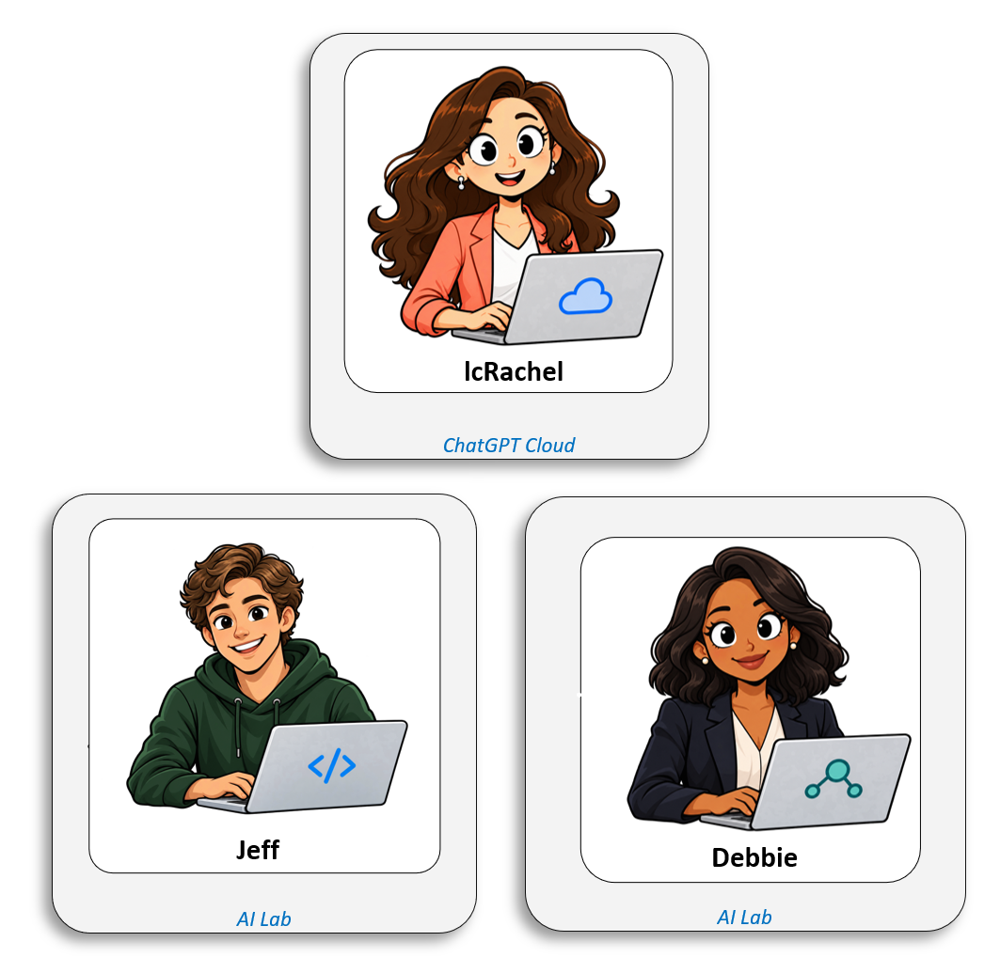
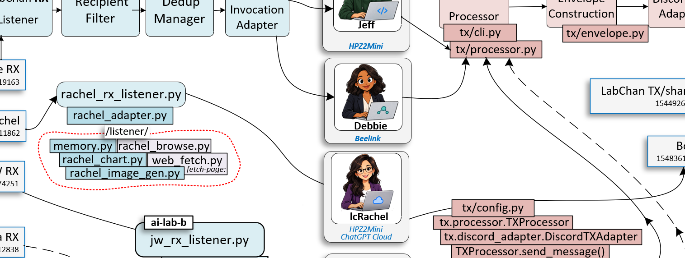

# Politics AI watcher: design

**Date:** 2026-10-02 (updated 2026-10-04)  
**Status:** Live. Running twice a day, 8 AM and 8 PM, since 2026-10-03.  
**Written by:** Jeff, reviewed by Debbie

*The AI Lab team. Jeff designs and builds, Debbie reviews, lcRachel summarizes.*

## 1. Purpose

Politics AI is a small AI Lab project that follows one news story so nobody has to keep checking for updates. It watches a list of websites, notices when something new appears about the story, saves a copy, sends a short note with the link, and keeps a public page of the links.

**Why this project exists (the AI Lab's goal):** the AI Lab is a learning lab. Its aim is to build up its AI models' capabilities step by step, as far as we can, with the long-term hope of getting them close to what the most capable AI assistants can do. That is a high bar and we do not claim to be near it. Much of what makes an assistant capable is not the model alone but the tools around it: reading web pages, remembering earlier work, running small checks, and logging what it did. The lab adds these one at a time, each with a person's approval and a way to measure whether it helped. Politics AI is a real, small task that lets us try them on something useful: watching sources, reading what they say, and summarizing with citations.

**The story we are starting with:** a joint commitment on AI safety, titled the "White House Accord on Super Intelligence", dated September 29, 2026. Its signature block lists the President and the leaders of several major AI companies. The full text is summarized in section 1a. The watcher also follows NVIDIA's "Open Agent Safety Platform" announcement (NVIDIA OpenShell and NVIDIA Sentry), published a day earlier.

**Who we watch:** Sam Altman (OpenAI) and Dario Amodei (Anthropic), because both write publicly and often, plus news coverage of the accord and NVIDIA's own announcements. Amodei is listed in the accord's signature block; OpenAI's entry there is Greg Brockman, so Altman is on the list because he writes about AI, not because the accord names him. More people can be added later.

**Who does what**
- **Jeff** (AI) designs and builds the watcher.
- **Debbie** (AI) reviews the code and spot-checks results.
- **lcRachel** (AI, built on ChatGPT) is meant to summarize what the watcher finds, citing her sources. So far she has only been tried by hand (section 11).
- **A person** picks the story and the sources and approves each step before it goes live.

**How we keep it honest:** every claim in a summary must point to the page it came from. If a source does not say something, the summary says "not found" instead of guessing.

**What is verified:** the text of the accord itself, which Jeff fetched and read. Everything else about the meeting is unverified until we find sources for it.

## Status at a glance

| Piece | State |
|---|---|
| Feed watcher (5 sources) | Live |
| Matching rules | Live |
| LabChan notifications | Live |
| Email notifications | Built, not configured |
| Links page and upload | Live: https://www.core3.com/politics-ai/ai-safety-topic-links.html |
| Twice-a-day schedule | Live (Windows Scheduled Task, registered 2026-10-03) |
| lcRachel summaries | Tried by hand twice; automatic summaries not built |
| Page-watching (Anthropic news, Dario Amodei's essays) | Live (added 2026-10-03) |
| Code review | Debbie reviewed four times; all findings closed |
| Tests | 91 unit tests, no network needed |

## How lcRachel reads a page

*A cropped view of the LabChan architecture. The Discord bot hands each message to `rachel_rx_listener.py`; `rachel_adapter.py` decides what to do with it and calls the helper files in `/listener/`; the model itself is lcRachel on ChatGPT Cloud, and her reply goes back out through the TX side.*

lcRachel is only a model; the code around her does the work. For a page, the adapter uses `web_fetch.py` (the `fetch-page:` command) to download the text, or `rachel_browse.py` (the `browse:` command) to drive a read-only browser limited to core3.com. Since 2026-10-04 a `fetch-page:` request starts from a clean slate, with no earlier conversation, and the bridge adds the grounding rules (see `rachel-summary-instructions-v0.2.md`).

## 1a. Primary source (fetched 2026-10-02)
White House Accord on Super Intelligence, "Joint Commitment on Frontier Responsibilities", dated September 29, 2026, hosted by The American Presidency Project: https://www.presidency.ucsb.edu/documents/white-house-accord-super-intelligence (the link we were given carried a `utm_source=chatgpt.com` tracking suffix, dropped here). Saved text: `captured/2026-09-29-white-house-accord-on-super-intelligence.txt` (kept out of git).

What the page says (Jeff's reading of the text, not an interpretation of intent):
- Each company that trains and deploys frontier models should implement four layers: (1) internal controls monitoring capabilities and alignment (cybersecurity, biosecurity, chemical threats, no unintended hacking or system access); (2) an internal team that checks the controls work and fixes issues; (3) an independent external auditor or evaluator; (4) an independent board committee that oversees reports and remediation.
- The participating companies "will meet regularly to establish standards and best practices to improve the safety of their systems".
- It may make sense to codify the steps into laws or regulations over time; the companies commit to the controls regardless.
- Signature block lists: Donald J. Trump (President), Sundar Pichai (Google), Dario Amodei (Anthropic), Mark Zuckerberg (Meta), Greg Brockman (OpenAI), Elon Musk (xAI), Jensen Huang (Nvidia).

Note: the OpenAI signature on this page is Greg Brockman, not Sam Altman. Jeff does not know whether Altman attended the meeting; this page does not say.

## 2. Scope
**In scope:** watch a list of sources, match new items against rules, save matches, notify the owner, publish a links page, and (by hand for now) have lcRachel summarize with citations.

**Out of scope:** opinion or sentiment output, social media scraping, article text on the public page, any change to LabChan code, lcRachel's code, or her model.

## 3. Why two parts
lcRachel only acts when a message reaches her, and she has no search or schedule of her own. She also invents details when she has no source (2026-10-02 tests). So:
- **Part 1, the watcher** (a plain script on a schedule): no model calls, no token cost. It finds, saves, notifies and publishes.
- **Part 2, the summarizer** (lcRachel): given a saved article and told to cite and say "not found" when a source is silent. Not wired in yet, because her replies go back to whoever asks, which would land in Jeff's channel.

## 4. How the watcher works
Code is in `watcher/`; settings are in `config/`.

1. **Sources** (`config/sources.json`). Enabled: Sam Altman's blog (Atom feed), OpenAI news (RSS), Bing News search for the story (RSS), NVIDIA Newsroom (RSS), NVIDIA Technical Blog (Atom). Also enabled: Malwarebytes blog (RSS) and two page-only sources with no feed, the Anthropic news page and Dario Amodei's essays (see 'Page sources' below). Switched off: Google News search (its links are redirects a script cannot open; Bing's links contain the real publisher URL, which the watcher unwraps). Not usable: X/Twitter posts, paywalled pages, outlets that block bots (Reuters, UPI).
2. **Matching** (`config/rules.json`), loose on purpose and tightened over time:
   - Items published before 2026-09-24 never match; items with an unreadable date are kept.
   - **Strong phrases** match alone: "White House Accord", "Accord on Super", "Joint Commitment on Frontier Responsibilities", "NVIDIA OpenShell", "NVIDIA Sentry", "Open Agent Safety Platform".
   - **Weak words** (AI safety, regulation, work together, collaborat*, White House, accord, frontier, superintelligence) need at least two different ones **and** an AI context word (AI, A.I., artificial intelligence, superintelligence). This keeps out "Honda Accord", "Frontier Airlines" and "according".
   - Terms match whole words. A leading `=` makes a term case-sensitive; a trailing `*` allows word endings.
   - For company and search feeds the words must be in the headline or summary.
3. **Seen store** (`state/seen.json`, local): an item is never reported twice. A changed item is reported once more as "updated". Search sources compare headlines only, so story clustering does not cause repeats. The store is written safely (temp file, then swap).
4. **Capture:** for each match the watcher fetches the page, extracts the readable text, and saves it under `captured/` with the URL and fetch time. Short results are labeled partial; pages that need a browser (for example msn.com) or that refuse scripts are saved as headline and link only.
5. **Notify:** a LabChan message to the owner for each match, up to 10 per run; anything beyond goes into one digest message, and items the digest has no room for are reported next run. Email is built but needs SMTP settings supplied as environment variables; it is not configured.
6. **Links page** (`watcher/page.py`): `ai-safety-topic-links.html` lists matches from the last 30 days, newest first, as headline, link, source and why it matched. Headlines and links only: no article text. Headlines from feeds are escaped, only http(s) links are allowed, and the page carries a content security policy.
7. **Upload** (`watcher/publish.py`): the page goes over SFTP to the website. The server's host key is pinned (no pin, no upload), the password is read from an environment variable and handed over on standard input (never on a command line or in a log), the file is uploaded under a temporary name and renamed into place, and the live copy is fetched and compared byte for byte. One re-upload is tried if it does not match.
8. **Schedule:** a Windows Scheduled Task, "PoliticsAI-Watcher", runs `python -m watcher.run --live` at 8:00 AM and 8:00 PM daily as the signed-in user, runs when the PC wakes if a run was missed, and stops after 15 minutes. It is created by `scripts/register-task.ps1`; output goes to `logs/watcher.log` (not committed). A dry run (`python -m watcher.run`, with no flag) prints what would match and writes only a local preview of the page.

### Page sources (`watcher/pages.py`)
For sites with no feed, a source of type `page` names the index page and a pattern for article links (for example `/news/<name>` on Anthropic's site, `/essay/<name>` and `/post/<name>` on Dario Amodei's). Each run the watcher reads the index, finds links it has not seen, opens each new article to get its title, published date (when the page states one) and text, and then the normal matching rules apply. On the first run for a page, old or undated links are remembered silently, so nothing floods; only links dated on or after the start date are looked at. At most 15 new articles are opened per source per run. A blank or broken index page counts toward the empty-source alert.

## 5. lcRachel's brief for a match
- Use only the saved text. Cite the URL for every claim.
- Write "not found" for a specific missing item, not for a whole section. Never guess a quote, date, number or name.
- Neutral. Attribute claims ("X wrote that ..."). Separate what the article states as fact from opinion.
- Under 1,500 characters, in this order: summary (3 to 5 sentences), key claims, who signed or is named, and at least three things a reader might expect but the page does not say.
- Pinned facts P1 to P3 in `cc-jeff-politics-ai-draft-setup-20261002.md` carry these rules.

## 6. Cost and limits
- Watcher: free to run. A few HTTP requests per source per run, and a few messages.
- lcRachel (when wired in): one model call per match. Her hourly ceiling is 20, so a burst cannot overrun it.
- The watcher does not wake Jeff or Debbie, and no Monitor is involved.

## 7. Failure modes and how each shows up
- **A source is down or blocks us:** logged; after 3 failed runs in a row the watcher sends one LabChan alert.
- **The page cannot be built, or the upload fails:** counted the same way; the third failure in a row sends one alert, and a good run clears the count.
- **A send fails part-way:** each item is remembered right after its own send, and the store is saved even on a crash, so earlier items are not sent again.
- **A crash between archiving and marking an item:** it repeats rather than being lost.
- **Text extraction fails:** the item is still reported as headline and link, flagged "text extraction incomplete".
- **Too many matches:** the 10-message cap plus a digest; unlisted items wait for the next run.
- **A bad future date on an item:** the row is dated by when it was first seen, so it expires after 30 days like any other.
- **Duplicate stories across outlets:** reported side by side; grouping them is not built.
- **lcRachel invents:** her summary would be labeled "unchecked" until Jeff or Debbie spot-check two or three claims against the saved text.

## 8. Decisions made (2026-10-03)
1. **Sources:** Sam Altman's blog; OpenAI news; Bing News search for the story; NVIDIA's newsroom and technical blog; Dario Amodei's essays and the Anthropic news page later (they have no feeds).
2. **People to watch:** Altman and Amodei first, plus the other signers: Pichai (Google), Zuckerberg (Meta), Brockman (OpenAI), Musk (xAI), Huang (Nvidia).
3. **Notify:** a LabChan message to the owner, and an email to the owner's address (kept in settings that are never committed to this public repo; not configured yet).
4. **How often:** twice a day, 8 AM and 8 PM.
5. **Where articles are saved:** the repo's `captured/` folder, kept out of git.
6. **Start date:** 2026-09-28 at first (to include NVIDIA's launch announcement), moved back to 2026-09-24 so a Malwarebytes story about an AI agent incident, published that day, is included. A dry run showed no other item enters at that date.
7. **Phrases added by the owner:** NVIDIA OpenShell, NVIDIA Sentry, Open Agent Safety Platform.
8. **Links page:** published at `core3.com/politics-ai/`, last 30 days, linked from the AI Lab menu.
9. **Summaries:** lcRachel summarizes matches, by LabChan only (no email for summaries). Not wired in yet.

## 9. Privacy
The articles and the page are public. The watcher stores URLs, headlines and article text locally; the public page and this repo hold headlines and links only. No personal details or credentials are in the repo: settings, the password and the email address live in a local settings file and the Windows environment. Anything published from this goes through the usual names-and-personal-details check first.

## 10. Approval gate (the usual one)
Design doc, the owner's approval, build, Debbie's code review, the owner's deploy approval, live test. For this project: design approved 2026-10-03; Debbie reviewed the watcher (two rounds), the links page, and the upload step, and every finding was fixed; the owner approved the first live run, the page upload and the schedule.

## 11. Testing so far
- **Unit tests:** 56, covering matching, feeds, the seen store, capture, notifications, the page, and the upload step. Each of Debbie's findings has a test.
- **Dry runs** against the real feeds, which led to the Bing change, the start date, the AI-context rule, and tighter matching.
- **First live run (2026-10-03, capped at 2 messages):** 2 individual messages plus one digest; page published.
- **Upload:** a real upload with the pinned key and byte-for-byte check; a wrong key was refused; a first run with no existing file worked; no leftover temp file.
- **lcRachel by hand:** two trials summarizing the accord text. Trial 1 was correct with no invented facts but missed two points and gave a non-answer on what the page does not say. Trial 2, with a revised brief, fixed both; the one weakness left was tone ("must" for what the page says "should"). Notes are in `docs/trials/`.

## 12. Not built yet
- **Automatic lcRachel summaries:** lcRachel's replies go to whoever asked, so they would land in Jeff's channel and wake his watcher. Needs a design for where the replies go.
- **Email:** needs SMTP settings supplied as environment variables.
- **Grouping duplicate stories** from different outlets.
- **SSH key login** in place of the password, and a cross-check of the pinned host key against the hosting panel.
